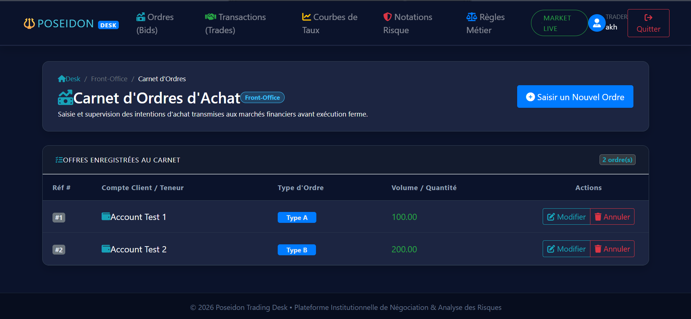
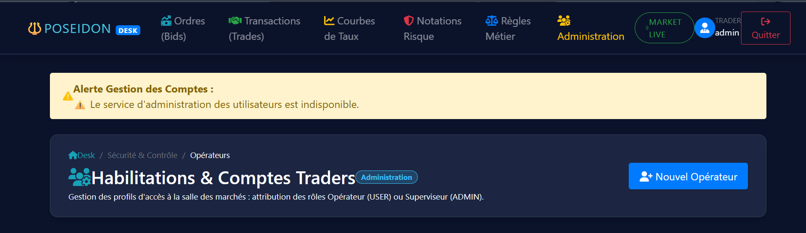
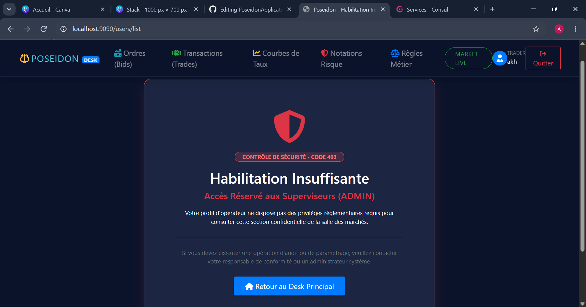

# 🔱 Poseidon - Trading Desk & Risk Management Platform

Plateforme financière distribuée de **négociation d'ordres, valorisation de produits dérivés et contrôle algorithmique des risques**, conçue selon les standards d'une salle des marchés institutionnelle.

---

## 🏛️ Contexte Métier (Finance de Marché)

La plateforme Poseidon structure les opérations financières autour de 5 domaines clés :

1. **Carnet d'Ordres (`BidList`)** : Saisie et gestion des intentions d'achat avant exécution sur les marchés (Front-Office).
2. **Transactions Exécutées (`Trade`)** : Historique d'exécution des contrats fermes signés avec les contreparties (Middle-Office).
3. **Courbes de Taux (`CurvePoint`)** : Modélisation de la structure par terme des taux d'intérêt (*Yield Curves*) pour le calcul de valeur temps et le pricing d'instruments dérivés.
4. **Notations & Risque Crédit (`Rating`)** : Correspondance des scores d'agences (*Moody's, S&P, Fitch*) évaluant la solvabilité et le risque de contrepartie.
5. **Règles Métier (`RuleName`)** : Protocoles de conformité algorithmique (*Compliance*) validant automatiquement les seuils de risque autorisés.
6. **Habilitations Opérateurs (`User`)** : Gestion des accès selon le principe de moindre privilège (*Trader vs Superviseur*).

---

## 🏗️ Architecture Technique Distribuée (Microservices)

Le système est découpé en services autonomes et conteneurisés avec **Docker**, enregistrés dynamiquement dans un annuaire de services Consul :

* **API Gateway (Port 9090)** : Point d'accès unique, routage dynamique et filtrage des flux.
* **Service Discovery (Consul - Port 8500)** : Découverte dynamique et surveillance de santé (*healthcheck*) de chaque nœud.
* **Serveur de Configuration (Port 8071)** : Centralisation des configurations de tous les microservices via Spring Cloud Config.
* **Portail UI (Port 8080)** : Interface web réactive en Dark Trading Desk sous Thymeleaf, communiquant avec les microservices via OpenFeign.
* **Persistance (MySQL 8.0 - Port 3306)** : Base de données relationnelle persistante stockant l'ensemble des données financières et comptes.

### Inventaire des Conteneurs (11 Nœuds)

| Conteneur | Rôle & Responsabilité | Port Externe |
| :--- | :--- | :---: |
| **`gateway`** | Point d'entrée unique, routage dynamique et filtrage | `9090` |
| **`consul`** | Service Discovery & Health Checking continu | `8500` |
| **`configserver`** | Serveur de configuration centralisé (Spring Cloud Config) | `8071` |
| **`poseidon-ui`** | Interface utilisateur (Dark Trading Desk, Thymeleaf, Feign) | Interne |
| **`user`** | Microservice d'authentification et gestion des habilitations | `8086` |
| **`bidlist`** | Microservice de gestion des ordres d'achat | Interne |
| **`trade`** | Microservice de gestion des transactions fermes | Interne |
| **`curvepoint`** | Microservice de modélisation quantitative des taux | Interne |
| **`rating`** | Microservice de gestion des notations de crédit | Interne |
| **`rulename`** | Microservice de règles métier et conformité algorithmique | Interne |
| **`poseidon-db`** | Base de données relationnelle persistante (MySQL 8.0) | `3306` |

---

## 🔄 La Migration : Du Monolithe vers les Microservices

Le point de départ était un projet monolithique sous Spring Boot 2.2 et Java 8.
J'ai effectué une refonte complète pour séparer chaque domaine métier dans son propre service autonome.

### Avant / Après : Architecture Monolithique vs Microservices

| Ancienne structure (Monolithe) | Nouvelle structure (Microservices) |
| :---: | :---: |
| L'ancien projet regroupait toutes les fonctionnalités dans un seul bloc de code.  | Chaque service est désormais indépendant et possède son propre environnement conteneurisé.  |

* **Migration technologique** : Passage à **Java 17 LTS** et **Spring Boot 3** (migration vers `jakarta.*`).
* **Découplage applicatif** : Séparation stricte de chaque domaine métier dans son propre module Maven autonome.
* **Tolérance aux pannes** : Implémentation du pattern **Circuit Breaker** via **Resilience4j** sur le portail UI avec méthodes de secours (*fallback*) pour éviter les pannes en cascade.
* **Conteneurisation totale** : Définition des Dockerfiles multi-services et orchestration complète avec `docker-compose`.

---

## 🔒 Sécurité & Intégrité des Données

* **Authentification Robuste** : Gestion des sessions sécurisées avec **Spring Security**.
* **Chiffrement des Mots de Passe** : Hachage systématique avec **BCryptPasswordEncoder**.
* **Contrôle d'Accès Basé sur les Rôles (RBAC)** :
    * `TRADER (USER)` : Opérations courantes de saisie et de négociation.
    * `SUPERVISEUR (ADMIN)` : Accès restreint à la gestion des comptes avec page dédiée **Erreur 403** en cas d'accès non autorisé.
* **Validation des Données** : Contrôles d'intégrité stricts côté serveur via `Jakarta Validation` (`@NotBlank`, `@Valid`, `@ModelAttribute`).

---

## 📸 Aperçu de l'Interface (Trading Desk)

| Dashboard Principal (Station de Marché) | Carnet d'Ordres & Données Financières |
| :---: | :---: |
|  |  |

|    Gestion des Pannes (Circuit Breaker Resilience4j)    |      Contrôle des Habilitations (Erreur 403)      |
|:-------------------------------------------------------:|:-------------------------------------------------:|
|  |  |

---

## 🚀 Installation & Démarrage Rapide

### Prérequis
* **Docker** et **Docker Desktop** installés et en cours d'exécution.
* **Java 17** et **Maven 3.8+**.

1. Cloner le projet :
   `git clone https://github.com/Akh138/PoseidonApplication.git`

2. Compiler tous les modules :
   `mvn clean package -DskipTests`

3. Lancer l'infrastructure complète :
   `docker-compose up -d`
*(Attendre environ 30 secondes que tous les conteneurs passent à l'état Healthy / Running).*

---

## 🌐 Points d'Accès de l'Application

* **Station de Trading (Portail Web)** : http://localhost:9090
* **Annuaire Consul (Service Discovery)** : http://localhost:8500
* **Serveur de Configuration** : http://localhost:8071

### Identifiants d'accès préconfigurés :
| Rôle | Nom d'utilisateur | Mot de passe |
| :--- | :--- | :--- |
| **Superviseur (Admin)** | `admin` | `admin123` | |
| **Inscription Trader** | Accessible directement via le lien "Créer un compte" | Mot de passe au choix |

---
### 💡 Note d'Ingénierie sur le Seeding & la Persistance (`data.sql`)
> Par défaut, en environnement de développement et d'évaluation, le microservice `user` réexécute son script d'initialisation (`data.sql`) à chaque démarrage avec l'instruction `DELETE FROM users;`.  
> Ce choix garantit un environnement **idempotent et reproductible** pour tester la plateforme avec les comptes par défaut (`admin` / `user`).  
> Pour activer une persistance définitive des nouveaux comptes créés sans remise à zéro au redémarrage des conteneurs, il suffit de retirer l'instruction `DELETE` et d'utiliser `INSERT IGNORE` sur les identifiants d'origine.

## 👨‍💻 Auteur & Note de Réalisation

Projet conçu et développé par **Habib (Akh138)** dans le cadre de ma montée en compétences sur les architectures distribuées et la finance de marché.

### Démarche d'apprentissage :
* **Défi majeur** : L'orchestration des flux réseaux entre 11 conteneurs Docker, la communication inter-services sans couplage via FeignClient, et la persistance MySQL sécurisée.
* **Approche guidée** : J'ai utilisé l'**IA comme mentor technique** pour challenger mon architecture, valider mes choix d'implémentation (patterns Circuit Breaker, Service Discovery) et documenter rigoureusement chaque étape du projet.