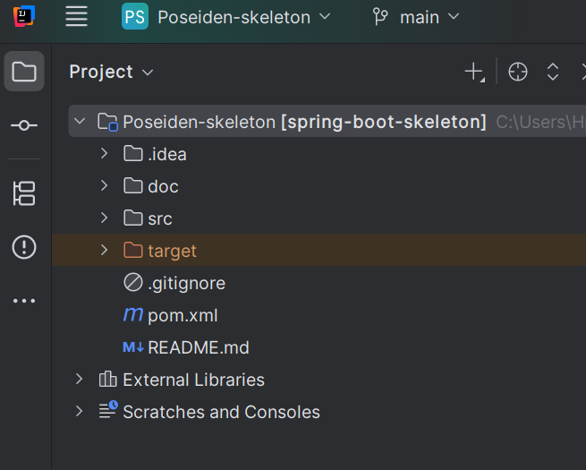
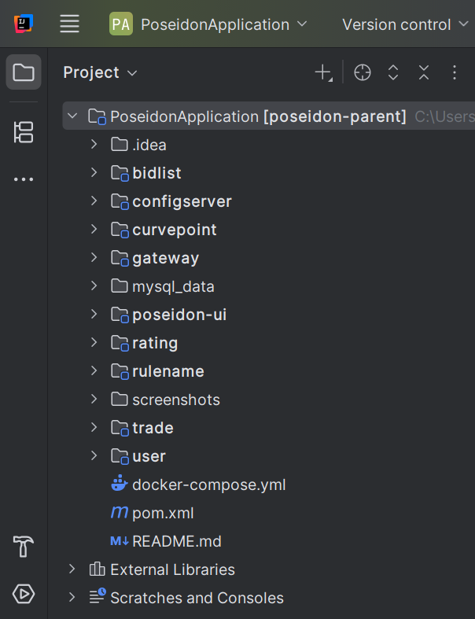
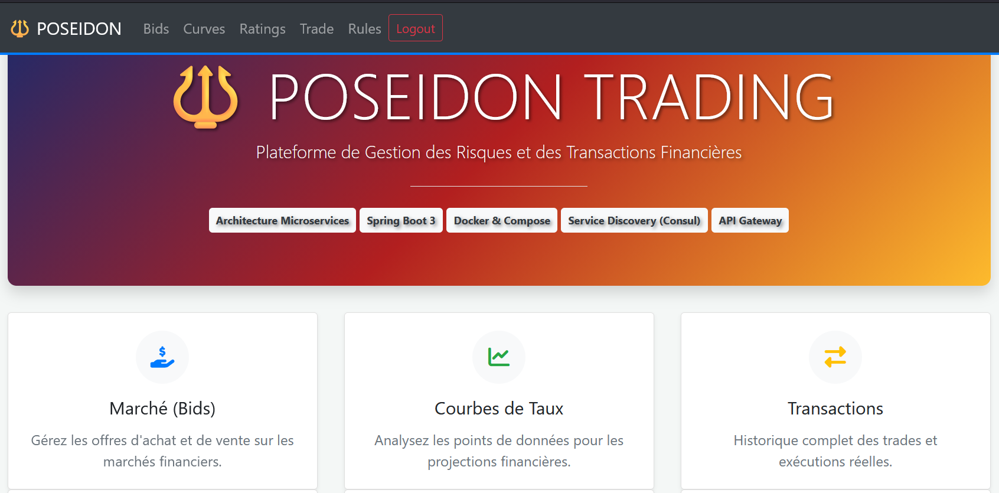
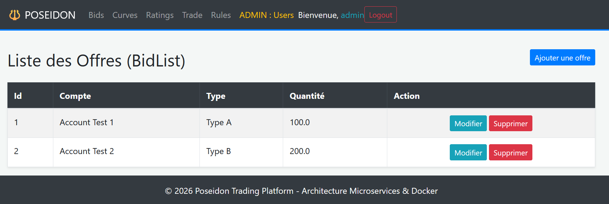
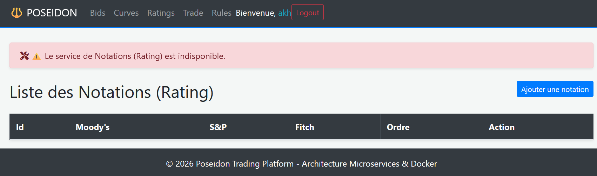
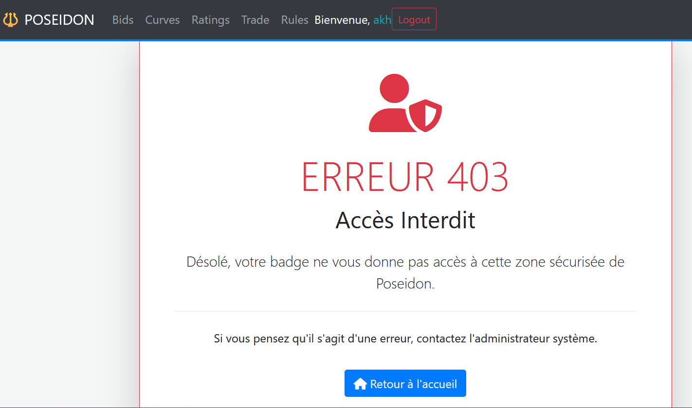

# Poseidon - Application de Trading & Gestion de Risques

Ce projet consiste en la refonte complète d'une application de gestion de risques financiers.
Je suis parti d'un "skeleton" monolithique pour construire une architecture distribuée, sécurisée et scalable

## Architecture du système

L'application est composée de 8 microservices qui communiquent au sein d'un réseau Docker :

*   **Gateway (9090)** : Point d'accès unique pour l'utilisateur.
*   **Portail UI (8080)** : Interface web (Thymeleaf / Bootstrap).
*   **Config Server (8071)** : Centralisation des configurations via un dépôt GitHub.
*   **Consul (8500)** : Annuaire pour la découverte automatique des services.
*   **Services Métier** : BidList, Trade, CurvePoint, Rating, RuleName et User.
*   **Base de données** : MySQL (persistant) et H2 (développement).

## La Migration : Du Monolithe vers les Microservices

Le point de départ était un projet monolithique sous Spring Boot 2.2 et Java 8.
J'ai effectué une refonte complète pour séparer chaque domaine métier dans son propre service.

### Avant : Architecture Monolithique
L'ancien projet regroupait toutes les fonctionnalités dans un seul bloc de code.

### Après : Architecture Microservices
Chaque service est désormais indépendant et possède son propre environnement.

## Stack Technique

Pour ce projet, j'ai choisi des outils modernes pour garantir la solidité du système :

*   **Java 17 & Spring Boot 3** : Utilisation de Jakarta EE pour la persistance des données.
*   **OpenFeign** : Pour une communication typée et simplifiée entre les services (au lieu de RestTemplate).
*   **Resilience4j** : Implémentation de disjoncteurs (Circuit Breaker) pour éviter les pannes en cascade.
*   **Spring Cloud Config** : Décentralisation des réglages sur un repo GitHub sécurisé.
*   **Docker & Compose** : Conteneurisation de chaque brique pour un déploiement facile.
*   **MySQL & H2** : Gestion de la persistance avec MySQL pour la production et H2 pour les tests.

## Comment lancer le projet ?

### Pré-requis
*   Docker & Docker Compose
*   Java 17 et Maven (pour compiler les JAR)

### Installation rapide
1. Cloner le projet :
   `git clone https://github.com/Akh138/PoseidonApplication.git`

2. Compiler tous les modules :
   `mvn clean package -DskipTests`

3. Lancer l'infrastructure complète :
   `docker-compose up -d`

### Accès
*   **Portail Web** : http://localhost:9090
*   **Annuaire Consul** : http://localhost:8500
*   **Identifiants par défaut** : admin / admin123

##  Aperçu de l'interface
Voici à quoi ressemble l'application finale une fois déployée :

### Dashboard Principal

### Gestion des données (Exemple : BidList)

### 1. Gestion des pannes (Circuit Breaker)

### 2. Sécurité et Rôles (RBAC)

##  Note de fin
Ce projet a été entièrement réalisé par **Habib (Akh138)**.
Il représente une étape majeure dans mon apprentissage des microservices.
Mon plus grand défi a été de configurer la communication sécurisée entre les 8 conteneurs 
et de gérer la découverte dynamique via Consul.
J'ai utilisé l'**IA comme un mentor technique**. Elle m'a accompagné pour structurer la documentation et m'a proposé des exercices de validation à chaque étape clé. Cette méthode m'a permis de m'assurer que chaque concept complexe (comme l'API Gateway, le Service Discovery avec Consul ou la résilience via Resilience4j) était parfaitement compris et maîtrisé avant d'être implémenté.
N'hésitez pas à consulter mon profil GitHub pour voir l'évolution de mes autres projets